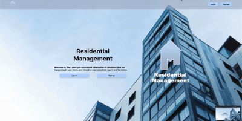

# Residential Management System

## Description 

Full-stack Residential Management system, where tenants and owners can submit reports about situations they are facing in their block, so the administrators can take action and update status of given report!

# My process

## Built with

- HTML5 markup on EJS
- CSS custom properties and some boostrap usage
- Flexbox
- Mobile first
- Express - Node framework
- Bcrypt
- Mongoose
- Passport
- and others

## What I learned

Started to use MVC paradigm wich facilitate thing with organization an helped me to identify efficienty where to go when changing things in code.

I actually learned lots of new stuff with this project and the usage of modules that i didn't know until now.

Ex:
- connect-flash: The flash is a special area of the session used for storing messages. Messages are written to the flash and cleared after being displayed to the user. 

- bcrypt: To help you hash passwords.

- Passport: an authentication middleware for Node.js

- Mongoose: Is a MongoDB object modeling tool designed to work in an asynchronous environment. Easiest to do certain stuff than with mongodb.

## Continue development

Working to get roles available on the app so the administrators can update the status of any given report. 

# Author

- [Erick's Portfolio](https://erickfelix.netlify.app/)
- [Twitter](https://twitter.com/efs0_code)